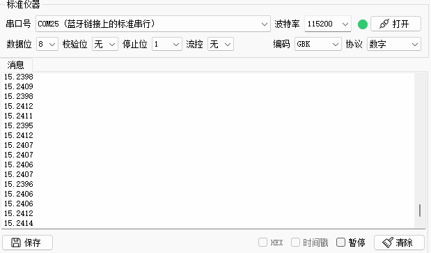
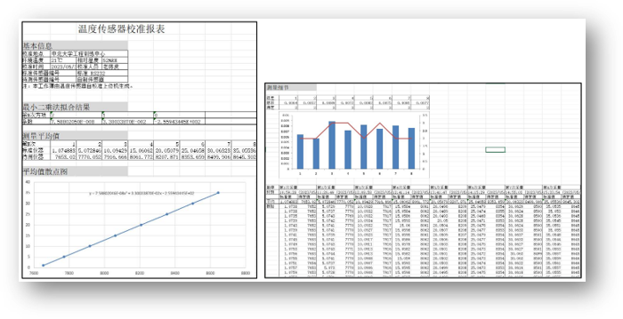

# 温度传感器校准上位机

**Fork** Me Please ~

Doc文件夹中有**答辩PPT**和**毕设说明书**。

毕设答辩实录：https://www.bilibili.com/video/BV1ek4y1p7Bp/

上位机支持多平台：


上位机功能模块框图：


串口收发：  


解析数据与波形绘制:  


波动监测：  


自动采集：  
  

最小二乘法拟合：  
  

语音提示：  
  
极差统计：  
  
数据保存为Xlsx表格：  
  
实时拟合误差指示：  
  
友好的界面设计：
  
  
  
测试结果：
  


# 开发环境与依赖

基于Qt 5.14.2 GCC开发  
## 依赖库
- OpenGl（可选）  
- Eigen-3.4.0
- QtXlsx-0.3.0（QXlsx对图表支持没QtXlsx良好）  

其中 QtXlsx 又依赖 Perl（Linux自带，Windows可以安装 Strawberry Perl 或者 ActivePerl 解决） 

## 打包命令
- Linux  ：linuxdeployqt（需要安装）  
- Windows：windeployqt（Qt自带）  
可使用 Enigma Virtual Box 进一步封包  

## 下载链接
共用：  
- Eigen：https://eigen.tuxfamily.org/index.php?title=Main_Page  
- QtXlsx：https://github.com/dbzhang800/QtXlsxWriter

Windows：  
- Strawberry Perl：https://strawberryperl.com  
- Enigma Virtual Box：https://enigmaprotector.com/en/aboutvb.html

Linux：  
- linuxdeployqt：https://github.com/probonopd/linuxdeployqt/releases

## 安装教程

QXlsx(不用编译也可以用的)： 
- https://www.cnblogs.com/ybqjymy/p/17244317.html
- https://www.codenong.com/cs106908387/
- https://www.bilibili.com/video/BV1Er4y1C78L/

OpenGl：  
- Linux：https://blog.csdn.net/sinat_33896833/article/details/107362959  
- Windows：https://blog.csdn.net/a6627651/article/details/10303869

linuxdeployqt：
- https://blog.csdn.net/qq_43627907/article/details/122021584

# 笔记

## 代码备忘

- InteractChart  
这里面时间轴单位是毫秒（qint64），但是有除以1000转换为秒（double），要注意。

- collectCounter  
  只有调用nextCollect()函数，才会有 collectCounter++

## 多线程

- https://blog.csdn.net/zong596568821xp/article/details/78893360  
在连接信号槽之前调用moveToThread，不需要处理connect的第五个参数，否则就显示声明用Qt::QueuedConnection来连接。  
把线程的finished信号和object的deleteLater槽连接，这个信号槽必须连接，否则会内存泄漏connect(m_objThread,&QThread::finished,m_objThread,&QObject::deleteLater);

- https://blog.csdn.net/qq_44365088/article/details/119087454

1、创建
```Cpp
TestObject* object = new TestObject;
QThread* thread = new QThread;
object->moveToThread(thread );
connect(thread,&QThread::finished,object,&TestObject::deleteLater);	// 退出后释放TestObject对象资源
connect(thread,&QThread::finished,thread,&QThread::deleteLater);	// 退出后释放QThread对象资源
```
2、退出
```Cpp
thread->quit();	// 也可以使用thread->exit(0);
thread->wait(); // wait函数是个阻塞的接口，意思是线程必须真的退出了，才会执行wait之后的语句，否则将会一直阻塞在这里，如果在界面上使用，需要保证线程中代码的合理性。
thread = nullptr;
object = nullptr;
```
